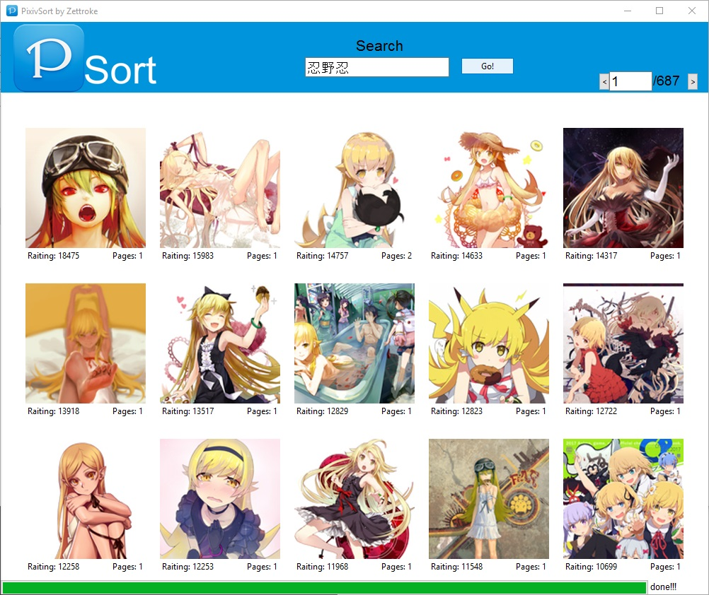

# PixivSort
Sort pixiv posts by popularity easy and for free.

Small python script which download pixiv posts found by your search request and sort them by popularity in descending order.
> Because of API restriction only 40000 posts will be downloaded and shown. 20000 newest and 20000 oldest.

There is bundled version for Windows. You can download it [here](https://github.com/Zettroke/PixivSort/releases).

To run it you need `python 3+`.

And following modules: `tkinter`, `requests`.

### Screenshots:

